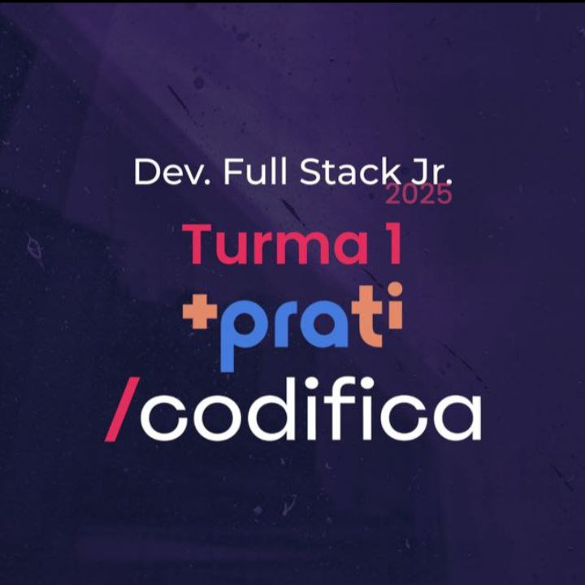

# Trilha Dev. Full Stack Jr.

  

## 📝 Descrição

Bem-vindo ao repositório do <strong>Full Stack Junior</strong>. O atual repositório tem como objetivo apresentar a resolução de tarefas propostas e exercícios práticos do curso de formação em desenvolvimento <strong>Full Stack Junior</strong>. O curso é oferecido pela <a href="https://maisprati.com.br/">+praTi</a> e <a href="https://www.codificaedu.com.br/">/codifica</a> e tem como foco o desenvolvimento de habilidades práticas e teóricas em programação, com ênfase em tecnologias utilizadas no mercado de trabalho.

## 🎓 Objetivo do Curso

Visa garantir a formação de profissionais na área de desenvolvimento de software, capacitados a resolver problemas computacionais com uma perspectiva crítica. Além disso, busca-se que esses profissionais apliquem suas habilidades de forma criativa, contribuindo para a criação de novas soluções no mundo moderno, em colaboração com empresas parceiras e que apoiam o projeto.

## 🏗️ Estrutura do Curso

O curso é dividido em módulos, cada um abordando diferentes tópicos e tecnologias. Abaixo está uma breve descrição de cada módulo:

-   **Módulo 1:** - Introdução à Ciência da Computação: Algoritmos e Estrutura de Dados;
-   **Módulo 2:** - Desenvolvimento Web: Front-End Essencial e Controle de Versão;
-   **Módulo 3:** - Desenvolvimento Web com React;
-   **Módulo 4:** - Fundamentos de Programação em Java e Introdução ao Ecossistema Spring;
-   **Módulo 5:** - Desenvolvimento Backend com Spring Framework e Bancos de Dados Relacionais;
-   **Módulo 6:** - DevOps Básico e Introdução à Inteligência Artificial com Python.

**Projeto Final: Desenvolvimento de uma Aplicação Web Completa**
